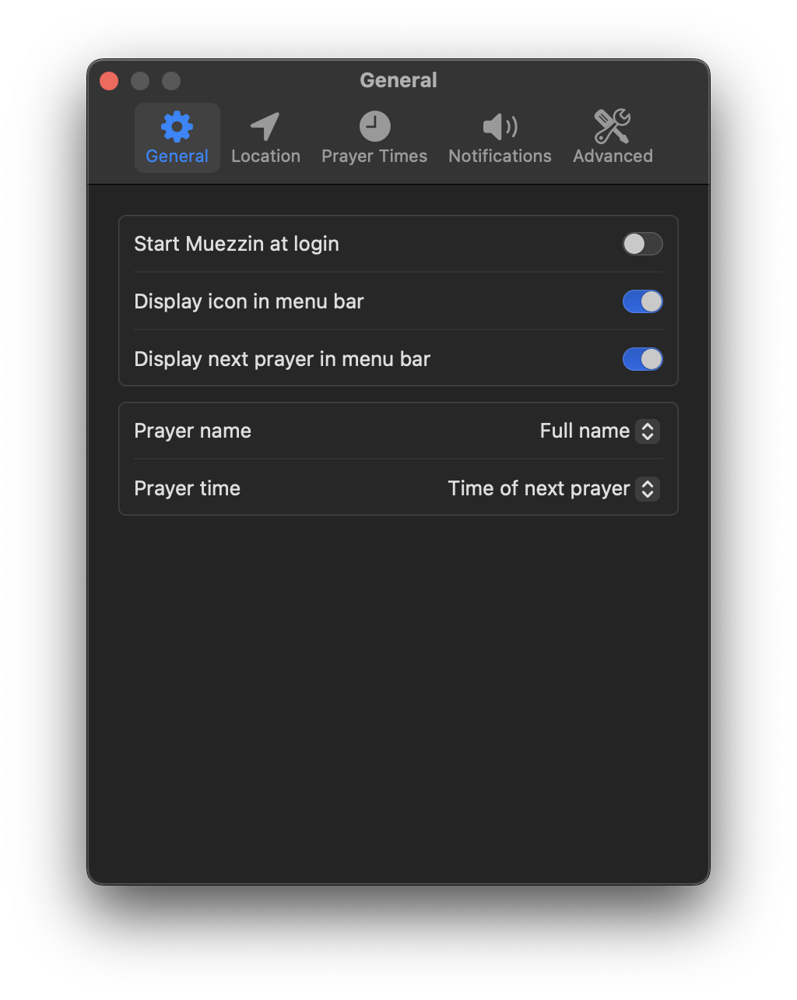

  

# Muezzin

A modern, simple macOS menu bar application designed to get athan times.

### Frameworks:
- SwiftUI
- MapKit
- CoreLocation
- AVFoundation
- [Adhan](https://github.com/batoulapps/adhan-swift)

### Features:
- Have access to your prayer times based on various calculation methods of your choosing.
- View all prayer times throughout the month. (WIP)
- View the Islamic date for your current location.
- Select a muezzin of your choosing for the athan sound.

### Images:

  
  
  
  

